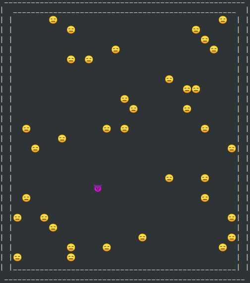

<p align="center">
    
</p>

# Agent Tag

A tag game simulator with simple agents

# Simulation rules


## Build

``` shell
cargo build --release
```

## Run

- Either the build result from the previous step.

    ``` shell
    cd target/release/
    ./agent-tag
    ```

- Or through cargo

    ``` shell
    cargo run
    ```

  - add flags to the cargo format after `--`

    ``` shell
    cargo run -- -h
    ```

## Options

Please see the flags and options bellow. All of them have sensible defaults, so just running the program without any should give you still a reasonable result.

### Help text

``` shell
agent-tag --help
```

``` output
agent-tag 0.1.0
A tag game simulator with stupid agents

USAGE:
    agent-tag [FLAGS] [OPTIONS]

FLAGS:
    -d, --disable-grid      Adding this flag disables the output of the field (grid). For benchmarking, when printing
                            the grid on the cli is not required
    -h, --help              Prints help information
    -p, --print-announce    During a run, announce that in the next visible frame, a tag will occur. Otherwise it is
                            easy to miss it
    -V, --version           Prints version information

OPTIONS:
    -a, --agents <agents>    Number of agents [default: 40]
    -m, --moves <moves>      Number of moves (tics) before the program finishes. Important for benchmarking, otherwise a
                             simple kill ^C works too [default: 10]
    -s, --size <size>        Size of field (grid) [default: 25]
    -t, --time <time>        Number of ms between tics [default: 1000]

```

### Very simple benchmark

Just running `time` (the common linux tool). This example runs with a 10.000 moves. When -t0 is set, there is no thread sleep called between the moves. Toggling the -d flag shows how much time is spent on the graphical aspect of the program.

``` shell
time target/release/agent-tag -t0 -m10000 -d

```

Without Raion:

``` output
________________________________________________________
Executed in   19,63 millis    fish           external 
   usr time   19,61 millis  528,00 micros   19,08 millis 
   sys time    0,21 millis  215,00 micros    0,00 millis 
```

with Raion:

``` output
________________________________________________________
Executed in  155,57 millis    fish           external 
   usr time  1208,72 millis  748,00 micros  1207,97 millis 
   sys time  541,37 millis    0,00 micros  541,37 millis 

```

The results are surprising. The refactor from Rc to Arc (and giving each agent it's own RNG) didn't slow down the run much. But when then used with Raion, to use more threads for the many agents, the release binary actually ran 4x slower. Even when raising the number of agents from 40 to 400, the binary without Raion (single threaded) was 4x faster.
Sometimes the results can vary allot based on use case and that's why these tests can be so useful when implementing parallelism. I left the two tested functions commented in the code with "# Raion"

Running just `time` is not a perfect benchmarking tool, especially for results under a second. But good enough for rough comparisons between different setups I guess.
